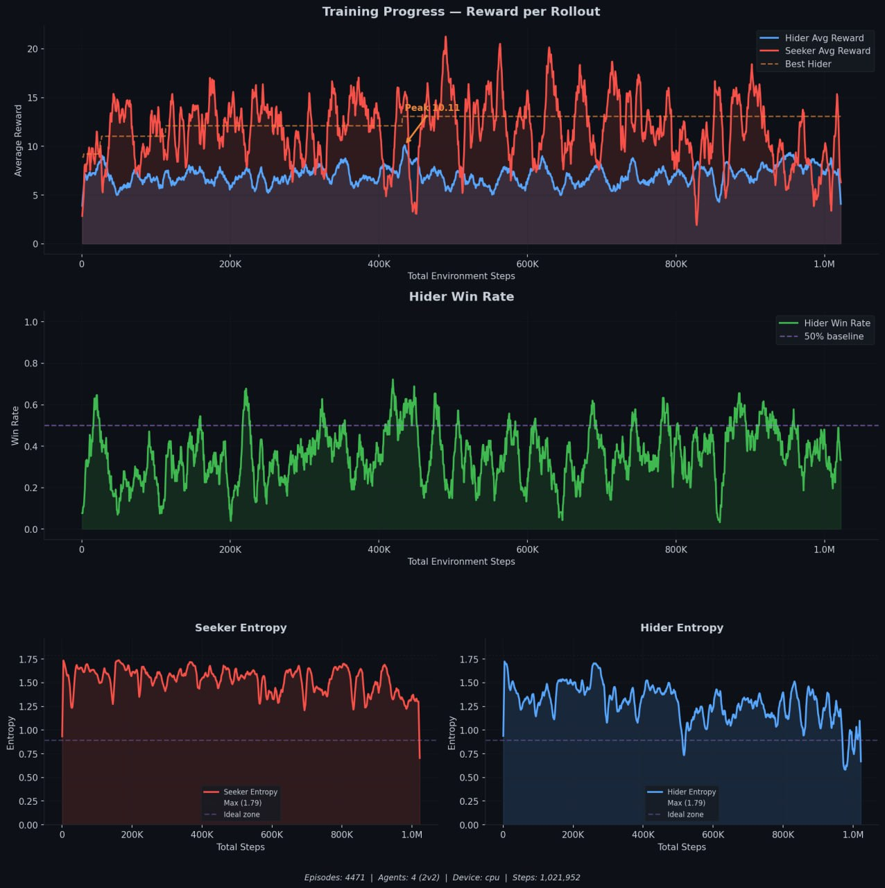

# Hide & Seek AI: Emergent Multi-Agent Behavior through Self-Play


Two teams of AI agents — **Hiders** and **Seekers** — compete in a 30×30 arena with **static walls** and **movable boxes**. Through pure self-play reinforcement learning, agents discover emergent strategies: hiders learn to build shelters using boxes and wall corners, while seekers learn to breach them. No behavior is manually programmed.

Inspired by OpenAI's 2019 paper *"Emergent Tool Use from Multi-Agent Autocurricula"*.

---

## Demo

> *Run `python visualize.py` after training to watch agents play in real-time.*



---

## Emergent Behavior Phases

Through self-play, agents progress through distinct strategic phases:

| Phase | Steps | Behavior |
|-------|-------|----------|
| 1 | 0 - 50K | **Random movement** — agents wander aimlessly |
| 2 | 50K - 150K | **Chase** — seekers learn to pursue hiders |
| 3 | 150K - 400K | **Evasion** — hiders learn to run away and use walls |
| 4 | 400K - 800K | **Shelter building** — hiders discover box manipulation, push boxes to create barriers |
| 5 | 800K - 1.5M | **Breaching** — seekers learn to push boxes aside, dismantle shelters |
| 6 | 1.5M+ | **Complex strategies** — coordinated defense, box locking, multi-box structures |

Each phase emerges as a counter-strategy to the previous one, creating an auto-curriculum.

---

## Architecture

```
                    ┌──────────────────────────────────────┐
                    │         Self-Play Training           │
                    │                                      │
  ┌─────────┐      │   ┌──────────┐    ┌──────────┐      │
  │  Arena   │◄────►│   │  Hider   │    │  Seeker  │      │
  │ (NumPy   │      │   │  PPO Net │    │  PPO Net │      │
  │  Vector) │      │   └────┬─────┘    └────┬─────┘      │
  └─────────┘      │        │               │             │
                    │   ┌────▼───────────────▼────┐       │
       ┌───────┐   │   │    Rollout Buffer        │       │
       │Checkpt│◄──│   │    + GAE Computation     │       │
       │ .pth  │   │   └──────────────────────────┘       │
       └───┬───┘   │                                      │
           │       │   ┌──────────────────────────┐       │
           │       │   │    Self-Play Pool         │       │
           │       │   │    (Past Opponents)       │       │
           │       │   └──────────────────────────┘       │
           │       └──────────────────────────────────────┘
           │
           ▼
     ┌───────────┐
     │ Pygame    │
     │ Visualizer│
     │ (Infer)   │
     └───────────┘
```

---

## Theoretical Foundation

### Proximal Policy Optimization (PPO)

PPO maximizes a clipped surrogate objective that constrains policy updates to a trust region, preventing destructive large steps:

$$L^{CLIP}(\theta) = \hat{\mathbb{E}}_t \left[ \min\left( r_t(\theta) \hat{A}_t,\ \text{clip}\left(r_t(\theta),\ 1-\epsilon,\ 1+\epsilon\right) \hat{A}_t \right) \right]$$

where the probability ratio is:

$$r_t(\theta) = \frac{\pi_\theta(a_t \mid s_t)}{\pi_{\theta_{\text{old}}}(a_t \mid s_t)}$$

The clipping mechanism ensures $r_t(\theta)$ stays within $[1-\epsilon, 1+\epsilon]$, providing a first-order approximation to the trust region constraint of TRPO without the computational overhead of conjugate gradient methods.

The full PPO loss combines three terms:

$$L(\theta) = L^{CLIP}(\theta) - c_1 \cdot L^{VF}(\theta) + c_2 \cdot H[\pi_\theta](s_t)$$

where $L^{VF}$ is the value function loss and $H$ is the entropy bonus.

### Policy Gradient Theorem

The fundamental theorem that underpins all policy gradient methods:

$$\nabla_\theta J(\theta) = \mathbb{E}_{\tau \sim \pi_\theta} \left[ \sum_{t=0}^{T} \nabla_\theta \log \pi_\theta(a_t \mid s_t) \cdot \hat{A}_t \right]$$

This states that the gradient of expected return with respect to policy parameters equals the expected sum of log-probability gradients weighted by advantage estimates. The advantage $\hat{A}_t$ acts as a critic, reducing variance compared to using raw returns.

### Actor-Critic Architecture

The network shares a backbone between two heads:

**Actor** (Policy Head): Outputs action logits $\pi_\theta(a \mid s)$, defining a categorical distribution over discrete actions.

**Critic** (Value Head): Estimates the state value function:

$$V_\phi(s) \approx \mathbb{E}\left[\sum_{t=0}^{\infty} \gamma^t r_t \mid s_0 = s\right]$$

Parameter sharing between actor and critic through the backbone provides implicit regularization and shared feature learning.

### Generalized Advantage Estimation (GAE)

GAE provides a family of advantage estimators parameterized by $\lambda \in [0, 1]$ that interpolate between high-bias (TD) and high-variance (Monte Carlo):

$$\hat{A}_t^{GAE(\gamma,\lambda)} = \sum_{l=0}^{\infty} (\gamma\lambda)^l \delta_{t+l}$$

where the TD residual is:

$$\delta_t = r_t + \gamma V(s_{t+1}) - V(s_t)$$

- $\lambda = 0$: One-step TD advantage (low variance, high bias)
- $\lambda = 1$: Monte Carlo advantage (high variance, low bias)
- $\lambda = 0.95$: Our setting, balancing bias-variance

### Centralized Training, Decentralized Execution (CTDE)

During **training**, the value function can access global state information from all agents, enabling better credit assignment:

$$V_i(s_1, s_2, \ldots, s_n) \quad \text{(centralized critic)}$$

During **execution** (inference), each agent's policy uses only its own local observations:

$$\pi_i(a_i \mid o_i) \quad \text{(decentralized actor)}$$

This paradigm enables agents to learn coordinated strategies during training while remaining independently deployable at inference time.

### Self-Play & Emergent Behavior

Self-play training maintains a pool of past policy checkpoints. Every $N$ episodes, the opponent is sampled from this pool:

$$\pi_{\text{opponent}} \sim \text{Uniform}(\mathcal{P})$$

where $\mathcal{P} = \{\pi_{\theta_1}, \pi_{\theta_2}, \ldots, \pi_{\theta_k}\}$ is the policy pool.

This creates an **auto-curriculum**: each new strategy that one team discovers forces the other team to develop a counter-strategy. The pool prevents **strategy collapse** (forgetting how to beat earlier strategies) by exposing agents to diverse opponents from different training stages.

---

## Reward Structure

| Signal | Type | Seeker | Hider |
|--------|------|--------|-------|
| Hider visible to seeker | Per-step | +0.08 | -0.08 |
| Hider hidden from seeker | Per-step | -0.08 | +0.08 |
| Chase proximity gradient | Per-step | +0.03 × (1-d/diag) | — |
| Pursuit (visible + close) | Per-step | +0.15 × (1-d/diag) | — |
| Evasion (visible + far) | Per-step | — | +0.15 × (d/diag) |
| Seeker spread bonus | Per-step | +0.05 × (d/diag) | — |
| **Catch** (within 4.5 + LOS) | Terminal | **+14.0** | **-14.0** |
| **Survival** (timeout) | Terminal | -8.0 | **+3.5** |
| Never seen bonus | Terminal | — | +1.0 |
| Idle > 8 steps | Per-step | -0.3 | -0.3 |

**Design principle:** Per-step rewards are small shaping signals (0.03–0.15). Terminal rewards are the main learning signal (3.5–14.0). This prevents reward scale imbalance and ensures meaningful policy learning.

---

## Neural Network Architecture

```
 Observation (obs_dim = 40)
         │
  Linear(256) → LayerNorm → ReLU
         │
  Linear(256) → LayerNorm → ReLU
         │
  ┌──────┴──────┐
  │             │
Policy Head   Value Head
Linear(6)     Linear(1)
 (logits)     (scalar V)
```

- **Orthogonal initialization** with gain $\sqrt{2}$ for hidden layers
- **Policy head** initialized with gain 0.01 for initial uniform exploration
- **LayerNorm** for training stability across diverse observation scales
- All agents on a team **share one network** (parameter sharing)
- **79,111 parameters** per team network

---

## Observation Space

Each agent receives a 40-dimensional observation vector:

| Component | Dimensions | Description |
|-----------|-----------|-------------|
| LiDAR rays | 9 | Normalized distances (0-1) from raycasting |
| Position | 2 | Normalized (x, y) in arena |
| Velocity | 2 | Current (vx, vy) |
| Team ID | 1 | 0 = hider, 1 = seeker |
| Nearby entities | 24 | Up to 6 entities × 4 features (rel_x, rel_y, type, team) |
| Grabbed flag | 1 | Whether agent is holding a box |
| Step fraction | 1 | Progress through episode (0-1) |

---

## File Structure

```
Hide & Seek/
├── train_from_scratch.ipynb   # Full training pipeline → data/checkpoint.pth
├── continue_training.ipynb    # Resume training from checkpoint
├── visualize.py               # Pygame real-time visualization (inference only)
├── data/
│   ├── checkpoint.pth         # Trained model weights (60M steps)
│   ├── train_progress.jpg  # Training charts (reward, win rate, entropy)
│   └── gameplay.gif           # 5-second gameplay demo
└── README.md                  # This file
```

Each notebook is **fully self-contained** — all classes, imports, and hyperparameters are defined inside. Runs on Kaggle without extra files.

---

## Quick Start

### Installation

```bash
pip install torch numpy matplotlib pygame
```

### Train from Scratch

1. Open `train_from_scratch.ipynb` in Jupyter or Kaggle
2. Run all cells — training begins automatically
3. Checkpoint saves every 50 episodes to `data/checkpoint.pth`

### Continue Training

1. Open `continue_training.ipynb`
2. Run all cells — auto-loads existing checkpoint and resumes

### Visualize

```bash
python visualize.py
```

**Controls:**

| Key | Action |
|-----|--------|
| SPACE | Pause / Resume |
| R | Reset episode |
| UP / DOWN | Speed 1x – 10x |
| S | Toggle sensor rays |
| ESC | Quit |

---

## Hardware Auto-Detection

The system detects hardware at startup and scales accordingly:

| Platform | Parallel Envs | Batch Size | PPO Epochs |
|----------|--------------|------------|------------|
| CUDA (T4/A100) | 64 | 2048 | 10 |
| Apple MPS (M-series) | 16 | 512 | 6 |
| CPU fallback | 4 | 256 | 4 |

---

## Benchmark Results

Training auto-adapts to hardware — GPU trains by step count, CPU/MPS by time:

| Hardware | Steps/sec | Stop Condition | Est. Time |
|----------|-----------|----------------|-----------|
| NVIDIA P100 (Kaggle) | ~60,000 | 60M steps | ~17 min |
| NVIDIA T4 (Kaggle) | ~90,000 | 60M steps | ~11 min |
| NVIDIA A100 | ~180,000 | 60M steps | ~6 min |
| Apple MPS (M-series) | ~45,000 | 2 min (time only) | 2 min |
| CPU (Kaggle / local) | ~5,000 | 30 min (time only) | 30 min |

---

## Arena Layout

```
  ┌──────────────────────────────────┐
  │  ┌──┐                    ┌──┐   │
  │  │TL│                    │TR│   │
  │  └──┤                    ├──┘   │
  │     │                    │      │
  │     │                    │      │
  │         ┌────────────┐          │
  │         │   CENTER   │          │
  │         │   CROSS    │          │
  │         └────────────┘          │
  │     │                    │      │
  │     │                    │      │
  │  ┌──┤                    ├──┐   │
  │  │BL│                    │BR│   │
  │  └──┘                    └──┘   │
  └──────────────────────────────────┘
        30×30 arena · 20 walls · 5 boxes
```

**20 static walls** form a center cross + 4 L-shaped corners + mid-field barriers, creating rooms and corridors. **5 movable boxes** can be pushed by agents to build shelters or breach them. Walls block movement, LiDAR rays, and line-of-sight.

---

## Key Design Decisions

**No epsilon-greedy.** Exploration is handled entirely by the PPO entropy bonus $c_2 \cdot H[\pi_\theta]$. This provides smooth, state-dependent exploration rather than random action injection.

**Parameter sharing within teams.** All hiders share one network; all seekers share another. This enforces homogeneous policies, reduces parameter count by $N\times$, and enables knowledge transfer between same-team agents.

**NumPy-vectorized physics.** All environment computations (movement, collision, LiDAR, line-of-sight) operate on batched arrays of shape `(num_envs, num_agents, ...)`. No Python loops over individual agents.

**Static walls + movable boxes.** Walls create strategic zones (rooms, corridors, dead-ends). Boxes are tools agents learn to use — hiders push them to seal gaps, seekers push them aside to breach. Walls affect LiDAR raycasting, line-of-sight checks, and agent/box collision.

**Self-play opponent pool.** Prevents strategy collapse by sampling opponents from a diverse pool of past policies, creating a natural auto-curriculum.

**Balanced reward scale.** Per-step rewards (0.03–0.15) provide directional shaping only. Terminal rewards (catch=14, survival=3.5) are the primary learning signal. This prevents reward scale imbalance that causes entropy collapse.

---

## References

1. Baker, B., et al. (2019). *Emergent Tool Use from Multi-Agent Autocurricula.* OpenAI. [arXiv:1909.07528](https://arxiv.org/abs/1909.07528)

2. Schulman, J., et al. (2017). *Proximal Policy Optimization Algorithms.* [arXiv:1707.06347](https://arxiv.org/abs/1707.06347)

3. Schulman, J., et al. (2015). *High-Dimensional Continuous Control Using Generalized Advantage Estimation.* [arXiv:1506.02438](https://arxiv.org/abs/1506.02438)

4. Lowe, R., et al. (2017). *Multi-Agent Actor-Critic for Mixed Cooperative-Competitive Environments.* [arXiv:1706.02275](https://arxiv.org/abs/1706.02275)

---

Made with ❤️ by uzbtrust
